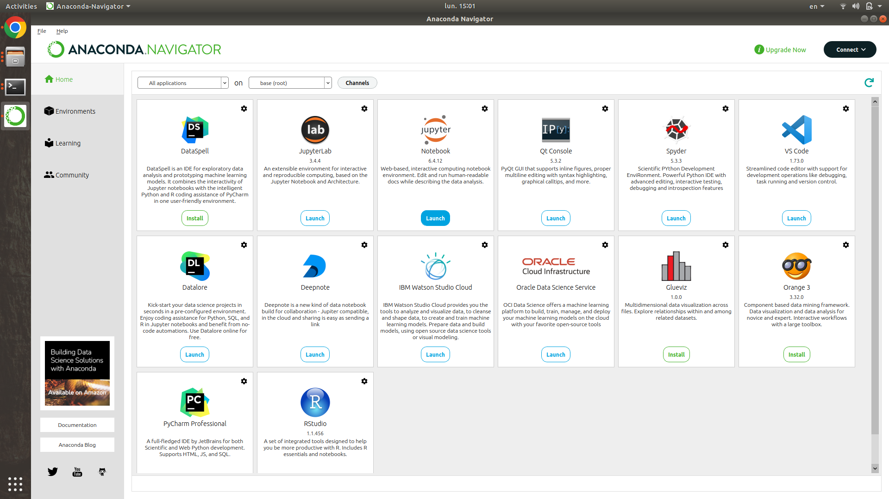

# Documents for PyOpt course

Warning: This project is in progress.

**Author:** [Tran Thu Le][le]

[le]: https://tranthule.blogspot.com/p/about-me.html

**Topics:**

- About Python

  - What is Python?
  - Where to code Python?
  - Basic concepts in Python?

- Gradient methods (from scratch and from packages)

  - Gradient method (Introduction with Python code)
  - ...

- For developers:
  - ...
  - ...

- Lecture notes:
	- [Coordinate Descent](https://www.stat.cmu.edu/~ryantibs/convexopt-S15/lectures/22-coord-desc.pdf)
	- [Sequential Quadratic Programming](https://www.math.uh.edu/~rohop/fall_06/Chapter4.pdf)
	- [Interior Point Method](https://www.math.uwaterloo.ca/~hwolkowi/henry/reports/talks.d/t06talks.d/06msribirs.d/summercoursemsri07.d/intptbookpgs.pdf)

<!-- add image

 -->
